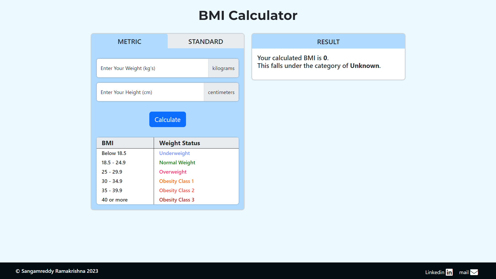
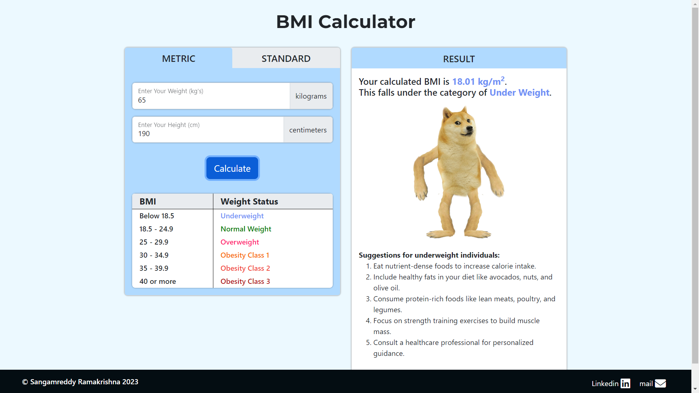
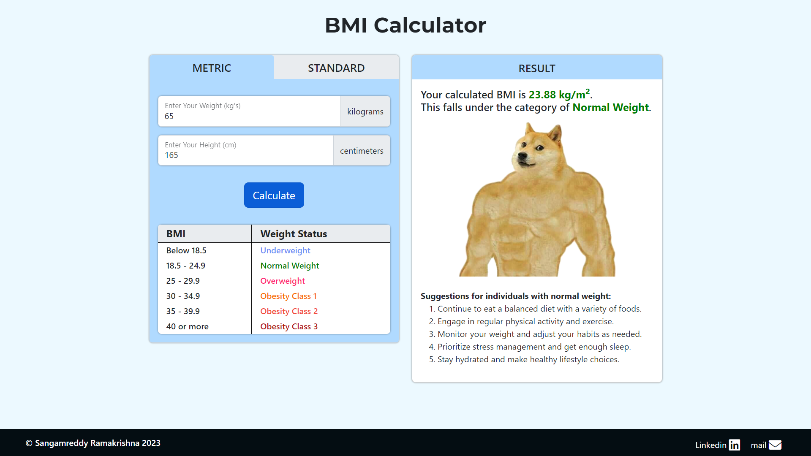
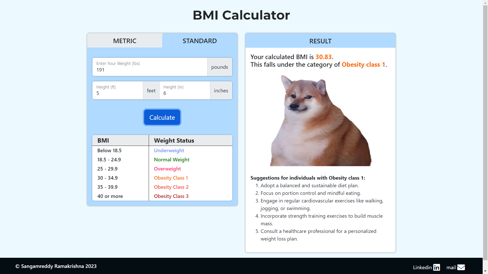
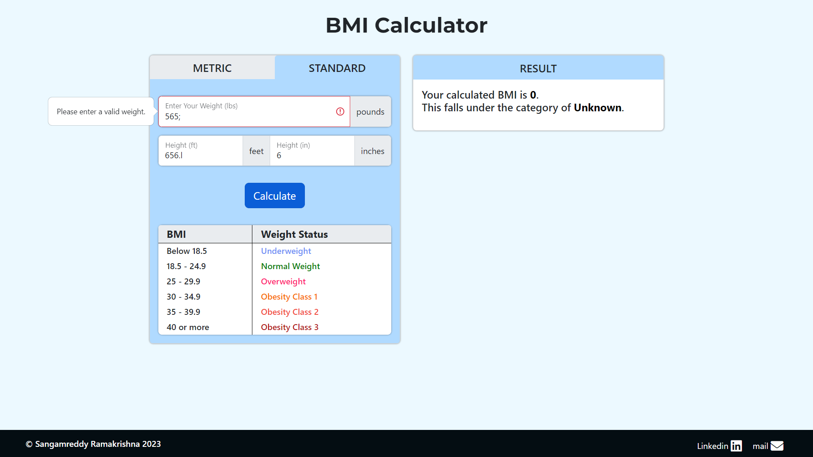

# BMI Calculator

A BMI (Body Mass Index) calculator that allows users to input their weight and height, either in metric or standard units, to calculate their BMI value and determine their weight status category.

## Table of Contents

- [Introduction](#introduction)
- [Features](#features)
- [Technologies Used](#technologies-used)
- [Installation](#installation)
- [Usage](#usage)
- [Screenshots](#screenshots)
- [Contributing](#contributing)
- [License](#license)

## Introduction

This project implements a BMI Calculator with a user-friendly web interface. Users can input their weight and height, choose between metric or standard units, and calculate their BMI value and weight status category. The project also provides suggestions based on the calculated BMI category.

## Features

- Metric and standard units options for weight and height.
- BMI calculation and weight status categorization.
- Display of BMI value and corresponding weight status.
- Display of funny images and suggestions based on BMI category.
- Responsive design for various screen sizes.
- User input validation and error messages.
- Clear separation of metric and standard calculations.

## Technologies Used

- HTML
- CSS
- JavaScript (with jQuery library)
- Bootstrap (for styling)
- Google Fonts
- Font Awesome Icons

## Installation

1. Clone this repository to your local machine.
2. Open the `index.html` file in a web browser to run the BMI Calculator.

## Usage

1. Open the BMI Calculator in a web browser.
2. Choose your preferred unit system (Metric or Standard).
3. Enter your weight and height in the corresponding fields.
4. Click the "Calculate" button to see your BMI value and weight status.
5. The calculated BMI category and a related image will be displayed, along with suggestions for your category.

## Screenshots

## Contributing

Contributions to this project are welcome. If you find any issues or want to add new features, feel free to create a pull request.

## License

This project is licensed under the [MIT License](LICENSE).
